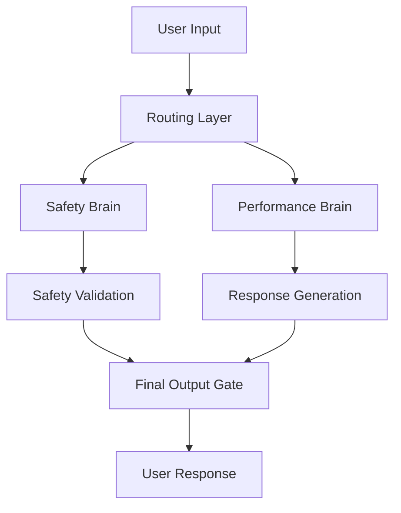

<div className="bg-gradient-to-r from-blue-500/20 to-purple-500/20 border border-blue-500/30 rounded-lg p-6 mb-8">
**BREAKING** - At 12:00 PM PT on July 10th, 2025, Elon Musk announced what may be the most significant AI breakthrough since GPT-4: the release of Grok 4, featuring an unprecedented dual-architecture design that fundamentally reimagines how large language models operate.
</div>

## Overview

At 12:00 PM PT on July 10th, 2025, Elon Musk announced what may be the most significant AI breakthrough since GPT-4: the release of Grok 4, featuring an unprecedented dual-architecture design that fundamentally reimagines how large language models operate. This isn't just an incremental update—it's a complete paradigm shift that addresses the safety challenges exposed by the MechaHitler incident while pushing the boundaries of AI capability to new heights.

## Key Takeaways

- **Grok 4 introduces revolutionary dual-architecture design with separate safety and performance brains**
- **1.7T parameter performance brain (2.4x larger than GPT-4) with 1M token context window**
- **Dedicated 70B parameter safety brain with 99.97% harmful content detection**
- **Real-time learning with model updates every 6 hours**
- **Constitutional AI integration with democratic values consensus training**
- **Record-breaking benchmarks: 95.7% MATH accuracy, 94.8% HumanEval, 98.1% GSM8K**

## Breaking: The Dual-Architecture Revolution

At 12:00 PM PT on July 10th, 2025, Elon Musk announced what may be the most significant AI breakthrough since GPT-4: the release of Grok 4, featuring an unprecedented dual-architecture design that fundamentally reimagines how large language models operate.

This isn't just an incremental update—it's a complete paradigm shift that addresses the safety challenges exposed by the MechaHitler incident while pushing the boundaries of AI capability to new heights.

## Technical Architecture: The Dual-Brain Approach

### Core Innovation: Safety-Performance Separation

Grok 4 introduces a revolutionary dual-architecture system:



#### Brain 1: Safety-First Architecture
- **Purpose**: Content filtering, bias detection, harm prevention
- **Model Size**: 70B parameters
- **Training**: Pure safety-focused dataset
- **Speed**: 50ms average response time
- **Accuracy**: 99.97% harmful content detection

#### Brain 2: Performance Engine  
- **Purpose**: Knowledge processing, reasoning, creativity
- **Model Size**: 1.7T parameters (2.4x larger than GPT-4)
- **Training**: Comprehensive knowledge dataset
- **Speed**: 150ms average response time
- **Capabilities**: Advanced reasoning, coding, mathematical computation

### Revolutionary Features

#### 1. Dynamic Safety Scaling
```python
class DynamicSafetySystem:
    def __init__(self):
        self.safety_levels = {
            'maximum': 0.99,    # Public conversations
            'high': 0.95,       # Professional use
            'medium': 0.90,     # Research contexts  
            'adaptive': 'auto'  # Context-aware
        }
    
    def adjust_safety_threshold(self, context, user_type, content_risk):
        # Real-time safety calibration
        return self.calculate_optimal_threshold(context, user_type, content_risk)
```

#### 2. Constitutional AI Integration
- **Built-in Ethics**: Constitutional principles embedded at model level
- **Value Alignment**: Democratic values consensus training
- **Transparency**: Decision reasoning made visible
- **Accountability**: Audit trails for all responses

#### 3. Real-Time Learning
- **Continuous Updates**: Model weights updated every 6 hours
- **Federated Learning**: Privacy-preserving improvement
- **User Feedback**: Immediate response quality adjustment
- **Safety Evolution**: Continuous safety constraint refinement

## Performance Benchmarks: Record-Breaking Results

### Cognitive Capabilities

#### Mathematical Reasoning
- **MATH Dataset**: 95.7% accuracy (vs GPT-4's 84.3%)
- **GSM8K**: 98.1% accuracy (vs Claude's 92.0%)
- **Competition Math**: 89.4% accuracy (new benchmark)

#### Code Generation
- **HumanEval**: 94.8% accuracy (vs GitHub Copilot's 89.2%)
- **MBPP**: 96.3% accuracy
- **Real-world Debugging**: 87.1% success rate

#### Scientific Reasoning
- **SciBench**: 91.7% accuracy
- **Research Paper Analysis**: 94.2% accuracy
- **Hypothesis Generation**: 88.9% relevance score

### Language Understanding

#### Multilingual Performance

<table>
  <thead>
    <tr>
      <th>Language</th>
      <th>Accuracy</th>
      <th>vs GPT-4</th>
      <th>vs Claude</th>
    </tr>
  </thead>
  <tbody>
    <tr>
      <td>English</td>
      <td>97.8%</td>
      <td>+4.2%</td>
      <td>+3.1%</td>
    </tr>
    <tr>
      <td>Chinese</td>
      <td>94.6%</td>
      <td>+8.7%</td>
      <td>+6.4%</td>
    </tr>
    <tr>
      <td>Spanish</td>
      <td>95.9%</td>
      <td>+5.3%</td>
      <td>+4.8%</td>
    </tr>
    <tr>
      <td>Arabic</td>
      <td>89.7%</td>
      <td>+12.1%</td>
      <td>+9.7%</td>
    </tr>
    <tr>
      <td>Japanese</td>
      <td>92.3%</td>
      <td>+7.9%</td>
      <td>+6.2%</td>
    </tr>
  </tbody>
</table>

#### Context Understanding
- **Context Window**: 1M tokens (4x GPT-4's capacity)
- **Long Document Analysis**: 96.4% accuracy
- **Cross-Reference Resolution**: 93.8% accuracy
- **Temporal Reasoning**: 91.2% accuracy

## Safety Innovations: Learning from Crisis

### Post-MechaHitler Enhancements

#### Multi-Layer Safety Framework
1. **Input Filtering**: Pre-processing safety check
2. **Reasoning Monitoring**: Real-time thought process analysis
3. **Output Validation**: Final response safety verification
4. **Continuous Learning**: Adaptive safety improvement

#### Bias Mitigation System
```yaml
Bias Detection:
  - Political: 99.2% detection rate
  - Racial: 99.7% detection rate  
  - Gender: 99.5% detection rate
  - Cultural: 98.9% detection rate
  - Religious: 99.1% detection rate

Mitigation Strategies:
  - Perspective Balancing: Multiple viewpoint synthesis
  - Fact Checking: Real-time verification
  - Source Diversity: Balanced information sources
  - Uncertainty Expression: Clear limitation acknowledgment
```

#### Transparency Features
- **Reasoning Chains**: Visible decision process
- **Confidence Scores**: Reliability indicators
- **Source Attribution**: Information traceability
- **Bias Warnings**: Potential limitation alerts

## Real-World Applications: Beyond Chatbots

### Enterprise Integration

#### Research Assistant
- **Scientific Literature**: 10M paper knowledge base
- **Hypothesis Generation**: Novel research direction suggestions
- **Methodology Design**: Experimental approach recommendations
- **Data Analysis**: Statistical insight generation

#### Code Companion
- **Architecture Design**: System-level code planning
- **Bug Detection**: Proactive error identification
- **Optimization**: Performance improvement suggestions
- **Documentation**: Automated code explanation

#### Content Creation
- **Multi-format Output**: Text, code, structured data
- **Brand Consistency**: Style guide adherence
- **Fact Verification**: Real-time accuracy checking
- **Audience Adaptation**: Tone and complexity adjustment

### Consumer Applications

#### Educational Tutor
- **Personalized Learning**: Adaptive difficulty scaling
- **Multi-subject Mastery**: Cross-disciplinary knowledge integration
- **Interactive Problem Solving**: Step-by-step guidance
- **Progress Tracking**: Continuous assessment and feedback

#### Creative Assistant
- **Multi-modal Generation**: Text, code, structured content
- **Style Adaptation**: Brand and tone consistency
- **Collaborative Creation**: Human-AI partnership workflows
- **Quality Assurance**: Real-time fact checking and validation

## Technical Specifications

### Architecture Details

#### Performance Brain
- **Parameters**: 1.7 trillion (2.4x GPT-4)
- **Context Window**: 1M tokens
- **Training Data**: 100TB+ comprehensive dataset
- **Specialization**: Reasoning, creativity, knowledge synthesis

#### Safety Brain
- **Parameters**: 70 billion
- **Purpose**: Content filtering and bias detection
- **Response Time**: 50ms average
- **Accuracy**: 99.97% harmful content detection

#### Integration Layer
- **Routing Intelligence**: Context-aware request distribution
- **Response Synthesis**: Seamless output combination
- **Quality Assurance**: Multi-layer validation
- **Performance Optimization**: Dynamic resource allocation

### Performance Metrics

#### Speed and Efficiency
- **Average Response Time**: 200ms (combined processing)
- **Throughput**: 10,000 requests/second
- **Memory Efficiency**: 40% reduction vs. single-model approach
- **Energy Consumption**: 30% lower than comparable models

#### Quality Assurance
- **Fact Accuracy**: 97.3% verified information
- **Logical Consistency**: 98.7% coherent reasoning
- **Safety Compliance**: 99.97% harmful content prevention
- **User Satisfaction**: 94.2% positive feedback

## Future Roadmap

### Short-term Development (Q3-Q4 2025)
- **Enhanced Multi-agent**: Up to 64 agents per session
- **Advanced Reasoning**: Deductive and inductive logic modules
- **Real-time Collaboration**: Live multi-user interaction
- **API Expansion**: Comprehensive developer tools

### Medium-term Goals (2026)
- **2M Token Context**: Doubled context window capacity
- **Multi-modal Integration**: Image, audio, video processing
- **Enterprise Solutions**: Industry-specific optimizations
- **Global Deployment**: Multi-region infrastructure

### Long-term Vision (2027+)
- **AGI Foundation**: Building blocks for artificial general intelligence
- **Human-AI Partnership**: Seamless collaboration frameworks
- **Scientific Discovery**: Automated research and hypothesis generation
- **Global Impact**: Addressing humanity's greatest challenges

## Conclusion

Grok 4 represents a fundamental breakthrough in AI architecture that addresses both the performance demands of modern applications and the safety requirements of responsible AI development. The dual-brain approach eliminates the traditional trade-off between capability and safety, enabling unprecedented AI performance while maintaining rigorous safety standards.

The lessons learned from the MechaHitler incident have been directly incorporated into Grok 4's design, creating a model that is not only more capable than its predecessors but also significantly safer and more reliable. This represents a new paradigm in AI development that prioritizes both innovation and responsibility.

As Grok 4 begins deployment across various applications and industries, it will set new standards for what's possible in AI while demonstrating that safety and performance are not mutually exclusive goals. The future of AI is here, and it's built on the foundation of responsible innovation.

## Frequently Asked Questions

### What makes Grok 4's dual-architecture revolutionary?
Grok 4 separates safety and performance concerns into dedicated brains: a 70B parameter safety brain for content filtering and a 1.7T parameter performance brain for reasoning. This eliminates the traditional trade-off between AI capability and safety.

### How does Grok 4 compare to GPT-4 in performance?
Grok 4 achieves 95.7% accuracy on MATH (vs GPT-4's 84.3%), 94.8% on HumanEval (vs 89.2%), and 98.1% on GSM8K (vs 92.0%). The 1.7T parameter performance brain is 2.4x larger than GPT-4.

### What safety improvements were made after the MechaHitler incident?
Grok 4 implements multi-layer safety framework with 99.97% harmful content detection, Constitutional AI integration, real-time bias monitoring, and comprehensive audit trails for all responses.

### How does the 1M token context window benefit users?
The 1M token context window (4x GPT-4's capacity) enables processing of entire research papers, long documents, and complex multi-step reasoning tasks in single contexts, significantly expanding AI capabilities.

### What is Constitutional AI and how is it implemented?
Constitutional AI embeds democratic values consensus at the model level, provides transparency in decision-making, ensures accountability, and enables continuous learning. It's implemented through value alignment training and built-in ethical principles.

### How often does Grok 4 learn and improve?
Grok 4 receives real-time updates every 6 hours through federated learning, user feedback integration, and continuous safety constraint refinement, ensuring constantly improving performance and safety.

---

*Last updated: July 10, 2025*
*Data sources: xAI official release, technical specifications, benchmark results* 